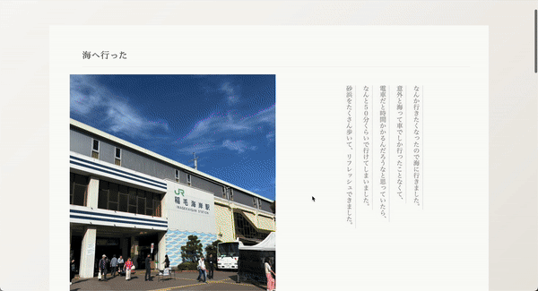
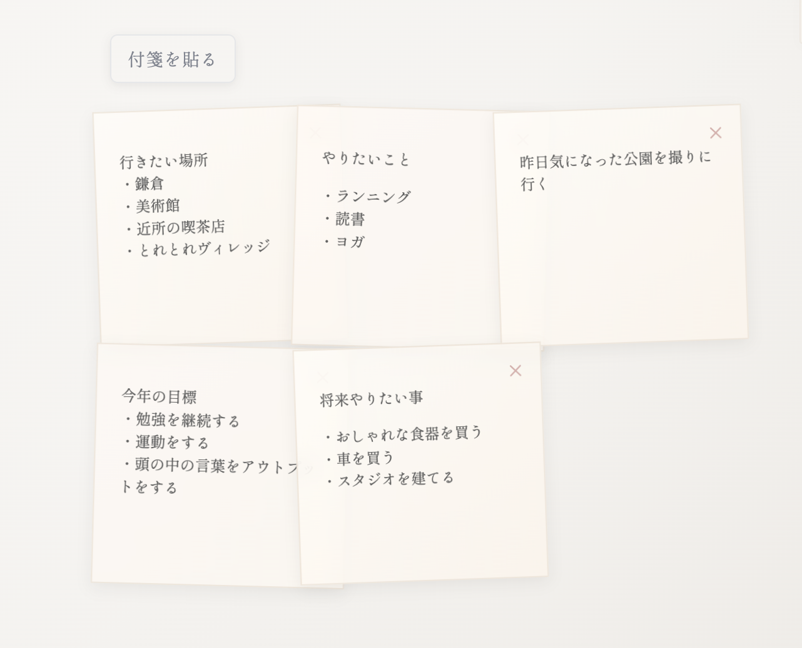

##  ■ はじめに
本リポジトリは、日常の写真や文章を、文庫本のような雰囲気で投稿できるアプリです。 

##  ■ アプリURL（現在公開停止しています❌）
https://travel-app-6yfc.onrender.com/spots 
(ログインなしでも利用可能)

## ■ アプリを作ったキッカケ
SNSに写真と文章を投稿すると写真の方が目立ち、文章がワンポイントとしての要素でしかなくなってしまうことに気付き、 
「文章にも写真と同じくらい存在感や雰囲気を持たせたい」という気持ちから開発しました。 

## ■ 特徴・コンセプト
- 文章に雰囲気や存在感を持たせるために、縦書きの本のような雰囲気で投稿できる 
- 人気の投稿がより見られるのではなく、どの投稿も人目に入るようにしたく、表示順は新着順のみにした
- マイページに付箋を貼る機能があり、やりたい事や行きたい場所を少し変わった形で表現することができる

## ■主な機能
- ユーザー登録・ユーザー削除・ログイン機能
- 記事投稿・削除機能
- レスポンシブ対応
- いいね機能
- 画像投稿機能
    - S3に保存
    - 投稿可能サイズ制限機能
- 投稿の位置情報共有機能 
    - 
- マイページ　
    - 投稿タブ、いいねタブ切り替え機能
    - ひとこと編集機能
    - 付箋を貼る機能 
    

## ■ 使用技術 
### バックエンド
- Ruby 3.4.3
- Rails 8.0.2
### フロントエンド
- HTML
- CSS
### データベース
- SQLite 3.43.2（開発）
- PostgreSQL 18 (本番)
### ストレージサービス
- Amazon S3
### インフラ / デプロイ
- Render
- Github(ソースコード管理)
